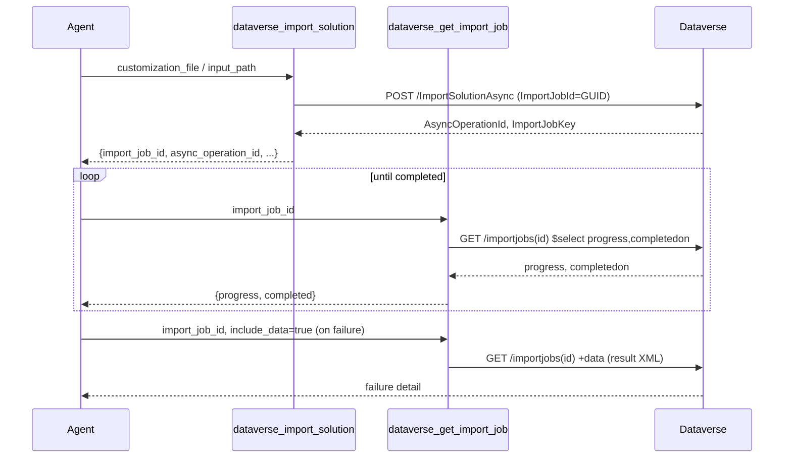

# Design: Solution import/export ALM tools (issue #91)

- Status: Draft   ·   Date: 2026-06-23   ·   Related: GitHub issue #91; category `solutions` in `solutions.py`

## Summary
Add five Dataverse ALM tools to `solutions.py`: `dataverse_export_solution`, `dataverse_import_solution`,
`dataverse_get_import_job`, `dataverse_list_import_jobs`, `dataverse_clone_solution_as_patch`. Export and
import handle a base64 solution `.zip` that easily exceeds the server's 5 MB response cap, so the design
uses an **optional local-filesystem path** on both tools (a new capability for this server) and an inline
base64 fallback only under a safe threshold. Import uses the **async** Web API action to avoid HTTP
timeouts; `get_import_job` / `list_import_jobs` close the loop by polling progress and surfacing the
result XML on failure.

## Context & problem
- `solutions.py` already owns solution CRUD, components, history, and publisher tools. These five tools
  belong in the same module and the `solutions` category (cloud-flow tools in the same file use the
  separate `flows` category).
- Two of the tools move a binary artifact (a solution `.zip`, base64-encoded in JSON). `finalize_response`
  in `client.py` rejects any payload over `_RESPONSE_MAX_BYTES` (5 MB) and warns over 1 MB
  (`_RESPONSE_WARN_BYTES`). Base64 inflates bytes ~33%, so a ~4 MB zip already breaches the cap. A naive
  "return base64 inline" design is dead on arrival for real solutions.
- Import is slow and synchronous import (`ImportSolution`) can exceed the 60 s httpx read timeout. Dataverse
  provides `ImportSolutionAsync` precisely to avoid this.
- The server today performs **no local filesystem writes** in tool code. Adding file I/O is a new
  capability and must be called out (path-safety, opt-in).

## Goals / Non-goals
- **Goals:** the five tools, verified against MS Learn; small responses; an async import that does not time
  out; a poll loop the agent can drive; a documented large-payload strategy.
- **Non-goals:** `StageSolution` / staged-upgrade workflow, `ExportSolutionAsync` /
  `DownloadSolutionExportData` (sync `ExportSolution` is enough for local-dev solution sizes),
  `CloneAsSolution`, `ApplySolutionUpgrade`/`DeleteAndPromote`, connection-reference/env-var remapping via
  `ComponentParameters`. These are follow-ups, not this issue.

## Verified Web API facts (source: MS Learn, dataverse-latest, accessed 2026-06-23)

All actions are POST to `{base}/api/data/v9.2/<Action>` (unbound) unless noted. Edm.Binary parameters and
return values serialize as **base64 strings** in JSON.

### ExportSolution (unbound action)
Source: <https://learn.microsoft.com/en-us/power-apps/developer/data-platform/webapi/reference/exportsolution>
- Params: `SolutionName` (Edm.String, **required**), `Managed` (Edm.Boolean, **required**),
  `TargetVersion` (deprecated — omit), and optional booleans `ExportAutoNumberingSettings`,
  `ExportCalendarSettings`, `ExportCustomizationSettings`, `ExportEmailTrackingSettings`,
  `ExportGeneralSettings`, `ExportMarketingSettings`, `ExportOutlookSynchronizationSettings`,
  `ExportRelationshipRoles`, `ExportIsvConfig`, `ExportSales`. (`ExportExternalApplications`,
  `ExportComponentsParams` are internal/advanced — out of scope.)
- Response: `ExportSolutionResponse` with one field **`ExportSolutionFile`** (Edm.Binary → base64 string).
  Source: <https://learn.microsoft.com/en-us/power-apps/developer/data-platform/webapi/reference/exportsolutionresponse>

### ImportSolutionAsync (unbound action) — chosen over sync ImportSolution
Source: <https://learn.microsoft.com/en-us/power-apps/developer/data-platform/webapi/reference/importsolutionasync>
- Params: `OverwriteUnmanagedCustomizations` (Edm.Boolean, **non-nullable/required**), `PublishWorkflows`
  (Edm.Boolean, **non-nullable/required**), `CustomizationFile` (Edm.Binary, base64), `ImportJobId`
  (Edm.Guid — **client-supplied** GUID that becomes the importjob primary key), `HoldingSolution`,
  `SkipProductUpdateDependencies`, `ConvertToManaged` (obsolete), `ComponentParameters`
  (Collection(crmbaseentity) — for env-var/connection-ref overwrite; **out of scope**), `SolutionParameters`
  (carries `StageSolutionUploadId` for staged import; out of scope). `SkipQueueRibbonJob`,
  `LayerDesiredOrder`, `AsyncRibbonProcessing`, `IsTemplateMode`, template fields = internal, omit.
- Response: `ImportSolutionAsyncResponse` with **`AsyncOperationId`** (Edm.Guid) and **`ImportJobKey`**
  (Edm.String). Source:
  <https://learn.microsoft.com/en-us/power-apps/developer/data-platform/webapi/reference/importsolutionasyncresponse>
  > Note the field is `ImportJobKey` (string), **not** `ImportJobId`. The GUID we supply in the request as
  > `ImportJobId` is the importjob primary key we later GET; `ImportJobKey` is the key for
  > `RetrieveFormattedImportJobResults`. The tool should generate the `ImportJobId` GUID client-side
  > (`str(uuid.uuid4())`) and echo it back so `get_import_job` can poll it directly.

### importjob (entity)
Source: <https://learn.microsoft.com/en-us/power-apps/developer/data-platform/reference/entities/importjob>
- EntitySetName **`importjobs`**, PrimaryIdAttribute **`importjobid`** (Uniqueidentifier).
- Progress/result columns: `solutionname` (string), `progress` (Double 0–100), `startedon`, `completedon`,
  `createdon` (DateTime), `name` (string), `solutionid` (Uniqueidentifier, read-only), and **`data`**
  (String, Format Text, **MaxLength 1,073,741,823** — the result XML; very large).
- **`data` must be excluded from default `$select`** — it is the one giant column. Expose it only when the
  caller explicitly opts in (e.g. `include_data=true` on `get_import_job`), and run it through
  `finalize_response` so an oversized XML returns the standard "too large" error rather than flooding.

### CloneAsPatch (UNBOUND action)
Source: <https://learn.microsoft.com/en-us/power-apps/developer/data-platform/webapi/reference/cloneaspatch>
- **Unbound** action — POST to top-level `/CloneAsPatch`. (VERIFIED LIVE: the docs list `solution`
  under "Entities", but the bound URL `solutions(<id>)/Microsoft.Dynamics.CRM.CloneAsPatch` returns
  HTTP 404. The parent is identified by `ParentSolutionUniqueName` in the body.) Resolve the parent
  to its unique name first (reuse `_resolve_solution_record`, accepting GUID or unique name).
- Params: `ParentSolutionUniqueName` (Edm.String, required), `DisplayName` (Edm.String, required),
  `VersionNumber` (Edm.String, required — must share the parent's major.minor and be greater).
- Response: `CloneAsPatchResponse` with one field **`SolutionId`** (Edm.Guid).
  Source: <https://learn.microsoft.com/en-us/power-apps/developer/data-platform/webapi/reference/cloneaspatchresponse>

### Async tracking
Source: <https://learn.microsoft.com/en-us/power-platform/alm/solution-async>
- Poll `asyncoperation(<AsyncOperationId>)` `$select=statecode,statuscode,message`. `statecode == 3` =
  Completed; then `statuscode == 30` = Succeeded, `statuscode == 31` = Failed. On failure, the human-readable
  reason is in `asyncoperation.message` and the structured detail is the importjob `data` XML.
- Equivalently, `importjob.progress` reaching 100 with a non-null `completedon` indicates completion. **The
  tools should poll the `importjob`** (it carries `progress`, `completedon`, and the result `data`), which is
  simpler than juggling two entities; surface `asyncoperation.message` only as an optional enrichment.

## Proposed design

### Shared decisions
- All five tools live in `solutions.py`, category `solutions`, reusing existing helpers (`resolve_base_url`,
  `build_headers`, `request_with_retry`, `_resolve_solution_record`, `tool_error_response`,
  `finalize_response`).
- New input models in `models.py`, each `ConfigDict(str_strip_whitespace=True, extra='forbid')`, `Field(...)`
  descriptions, GUID validators reusing `_GUID_PATTERN`.
- New module constant `_SOLUTION_JOB_TIMEOUT = 600.0` (see Decision D) for export/import POSTs.
- New module constant `_INLINE_FILE_MAX_BYTES = 3_000_000` — base64 length above which inline return/accept
  is refused in favour of a path (decoded zip ≈ 0.75× of this; stays well under the 5 MB cap with JSON
  envelope overhead).

---

### 1. `dataverse_export_solution` — gate: `@tool` (default/read-ish, see Decision E)
- **Input `ExportSolutionInput(DataverseEnvironmentInput)`:** `solution_name: str` (required, the
  uniquename), `managed: bool = False`, `output_path: str | None = None`, plus optional export-setting
  booleans (`export_general_settings`, `export_customization_settings`, etc.) defaulting to `None` (omitted
  from the request body when None). No exactly-one-of constraint — `output_path` is purely optional.
- **Calls:** `POST /ExportSolution` with `{SolutionName, Managed, ...settings}`, timeout
  `_SOLUTION_JOB_TIMEOUT`. Reads `ExportSolutionFile` (base64) from the response.
- **Response (Decision A — local path primary):**
  - `output_path` provided → decode base64, write `.zip` to that path, return
    `{"written": true, "path": <abs>, "size_bytes": <int>, "solution": <name>, "managed": <bool>}`. No
    base64 in the response.
  - `output_path` omitted **and** base64 length ≤ `_INLINE_FILE_MAX_BYTES` → return
    `{"solution_file_base64": <b64>, "size_bytes": ..., "solution": ..., "managed": ...}` via
    `finalize_response`.
  - `output_path` omitted **and** over threshold → structured error:
    `{"error": true, "message": "Exported solution is N MB; supply output_path to write it to disk instead of returning it inline."}`.

### 2. `dataverse_import_solution` — gate: `@write_tool`
- **Input `ImportSolutionInput(DataverseEnvironmentInput)`:** exactly-one-of
  `customization_file: str | None` (inline base64) **xor** `input_path: str | None` (read `.zip` from disk,
  base64-encode); `overwrite_unmanaged_customizations: bool = True`; `publish_workflows: bool = True`;
  `hold_for_upgrade: bool = False` (→ `HoldingSolution`); `skip_product_update_dependencies: bool = False`.
  A `model_validator` enforces exactly one of `customization_file`/`input_path`. Reject inline
  `customization_file` whose length exceeds `_INLINE_FILE_MAX_BYTES` (point caller at `input_path`).
- **Calls:** generate `import_job_id = str(uuid.uuid4())`; `POST /ImportSolutionAsync` with
  `{CustomizationFile, OverwriteUnmanagedCustomizations, PublishWorkflows, ImportJobId: import_job_id,
  HoldingSolution, SkipProductUpdateDependencies}`, timeout `_SOLUTION_JOB_TIMEOUT`.
- **Response (Decision C):**
  `{"accepted": true, "import_job_id": <our GUID>, "async_operation_id": <AsyncOperationId>,
  "import_job_key": <ImportJobKey>, "message": "Import started; poll dataverse_get_import_job with import_job_id."}`.

### 3. `dataverse_get_import_job` — gate: `@tool`
- **Input `GetImportJobInput(DataverseEnvironmentInput)`:** `import_job_id: str` (GUID, required, validated);
  `include_data: bool = False`.
- **Calls:** `GET /importjobs(<id>)?$select=importjobid,solutionname,progress,startedon,completedon,createdon,name,solutionid`
  (and `,data` only when `include_data`). On 404 return the standard not-found error. (NOTE: the field is
  `solutionid` — a Uniqueidentifier attribute, NOT a `_solutionid_value` lookup. Live-verified.)
- **Response:** `{"record": {...}, "completed": <completedon is not null>, "progress": <float>}` via
  `finalize_response` (so a large `data` XML is guarded). This is the poll endpoint that closes the async
  loop.

### 4. `dataverse_list_import_jobs` — gate: `@tool`
- **Input `ListImportJobsInput(DataverseEnvironmentInput)`:** optional `solution_name: str | None` (filter on
  `solutionname`), `top: int = 50` (ge=1, le=5000), `select: list[str] | None`.
- **Calls:** `GET /importjobs` with `$select` defaulting to a projection that **excludes `data`**, ordered
  `$orderby=createdon desc`, optional `$filter=solutionname eq '<escaped>'` via `odata_quote`. Use
  `paginate_records`.
- **Response:** `{"records": [...], "count": N, "has_more": ...}` via `finalize_response`.

### 5. `dataverse_clone_solution_as_patch` — gate: `@write_tool`
- **Input `CloneSolutionAsPatchInput(_SolutionIdentifierInput)`:** inherits the existing exactly-one-of
  `solution_id`/`solution_unique_name`; adds `display_name: str` (required), `version_number: str`
  (required).
- **Calls:** resolve parent → `uniquename` via `_resolve_solution_record`; `POST` unbound
  `/CloneAsPatch` with `{ParentSolutionUniqueName, DisplayName, VersionNumber}`.
- **Response:** `{"cloned": true, "patch_solution_id": <SolutionId>, "parent_solution_unique_name": ...,
  "version_number": ...}`.

### Async import flow

## Decisions (A–E)

**A. Export large-payload handling → optional `output_path`, inline fallback under threshold, structured
error otherwise (option a).** Rationale: keeps responses under the 5 MB cap by construction; real solutions
fit the local-dev ALM workflow where a `.zip` on disk is exactly what the user wants next (source control,
re-import, `pac`). Trade-offs: (1) this introduces the **first filesystem write in tool code** — flag as a
new capability; the developer must (a) expand `~`/resolve to an absolute path, (b) write only when the parent
dir exists or create it explicitly, (c) refuse to clobber silently is optional but reject obviously unsafe
inputs, (d) wrap I/O errors into the standard `{"error": true, ...}` contract (no uncaught exceptions). (2)
The server process writes wherever it has OS permissions — acceptable because this is a local/desktop MCP
server the user runs themselves, but document it. (3) Inline fallback keeps small exports ergonomic for
agents that cannot see the filesystem. Rejected (b) raise the cap — a multi-hundred-MB base64 blob in a tool
response is hostile to the LLM context regardless of cap; rejected (c) metadata-only — useless for the
actual export use case.

**B. Import input → exactly-one-of `customization_file` (inline base64) xor `input_path` (read from disk),
`input_path` is the primary path for real solutions.** Mirrors A. Validation: a `model_validator` requires
exactly one; inline base64 over `_INLINE_FILE_MAX_BYTES` is rejected with a message pointing to `input_path`;
`input_path` read errors map to the standard error contract. `input_path` is primary because exported
solutions live on disk; inline is the convenience path for tiny solutions or agent-generated content.

**C. Async import.** Use `ImportSolutionAsync` (not sync `ImportSolution`) so large imports do not hit the
60 s httpx read timeout. The tool returns immediately with `import_job_id` (our supplied GUID),
`async_operation_id`, and `import_job_key`. The loop is closed by `dataverse_get_import_job` (poll
`progress`/`completedon`; fetch `data` XML on failure with `include_data=true`) and
`dataverse_list_import_jobs`. We poll the **importjob** entity rather than asyncoperation because it carries
progress + result in one record; `asyncoperation.message` is an optional future enrichment.

**D. Timeouts → `_SOLUTION_JOB_TIMEOUT = 600.0`, a new module constant in `solutions.py`** (alongside
`_BATCH_TIMEOUT`/`_FLOW_STATE_TIMEOUT`). Applied to the `ExportSolution` and `ImportSolutionAsync` POSTs.
Export is synchronous and can be slow; `ImportSolutionAsync` returns quickly but 600 s is a safe ceiling and
costs nothing when the call is fast.

**E. Category/gating.** All five are in `solutions.py`, category `solutions`. Gates: `import_solution` and
`clone_solution_as_patch` are mutating → `@write_tool` (`destructiveHint=False`, `idempotentHint=False`).
`get_import_job` and `list_import_jobs` are reads → `@tool` (`readOnlyHint=True`, `idempotentHint=True`).
**`export_solution` → `@tool` (default), not `@write_tool`** — it changes nothing in the org (read-ish, heavy
but side-effect-free), so gating it behind `DATAVERSE_ALLOW_WRITE` would wrongly hide a non-mutating tool.
Annotate it `readOnlyHint=True, idempotentHint=True`. (Caveat: it *does* write to local disk when
`output_path` is set — that is local I/O, not an org mutation, so it does not change the org-write gate
classification; call this out in the tool description.)

## Affected areas & work split
- **developer (single scope — all in one PR):**
  - `src/dataverse_mcp/models.py`: add `ExportSolutionInput`, `ImportSolutionInput`, `GetImportJobInput`,
    `ListImportJobsInput`, `CloneSolutionAsPatchInput` (the last extends `_SolutionIdentifierInput`).
  - `src/dataverse_mcp/tools/solutions.py`: add the 5 tool functions, `_SOLUTION_JOB_TIMEOUT`,
    `_INLINE_FILE_MAX_BYTES`, default importjob `$select` constant, and small file-read/write helpers
    (decode-to-disk, read-and-encode) with errors mapped to the standard contract.
  - `CHANGELOG.md`: one `[Unreleased]` entry for the new ALM tools.
  - Tests per the repo's testing philosophy (live integration first; unit tests for the base64/path
    validation and the exactly-one-of validators where they earn their keep).
  - README / tool docs: note the new filesystem-write capability and the `solutions` category count bump.
- **devops-engineer:** none — no CI/CD or IaC change.

## Risks & open questions
- **Filesystem writes are new.** First time tool code touches local disk. Path safety, dir creation, and
  error mapping are the developer's responsibility; keep it minimal (no traversal cleverness — just resolve,
  create parent if needed, write, map errors).
- **`ImportSolutionAsync` may still require a valid solution and may 400 synchronously** on malformed
  payloads before going async — verify live that a happy-path call returns 200/204 with the
  `ImportSolutionAsyncResponse` body and not an empty 202. Confirm the JSON response actually carries
  `AsyncOperationId` + `ImportJobKey` (some Dataverse actions return the complex type inline; verify shape).
- **`importjob` may not exist immediately** after `ImportSolutionAsync` returns (race between async job
  creation and our GET on the supplied `ImportJobId`). Verify whether a brief 404 window exists and whether
  the tool should treat an early 404 as "pending" rather than "not found".
- **CloneAsPatch is bound** — verify the exact bound-action URL casing
  (`Microsoft.Dynamics.CRM.CloneAsPatch`) works against a live org and that `ParentSolutionUniqueName` is
  still required in the body even though the binding identifies the solution.
- **Edm.Binary JSON encoding** — confirm Dataverse accepts/returns `CustomizationFile` /
  `ExportSolutionFile` as plain base64 strings in the JSON body (it does for Web API, but verify no
  `@odata`-wrapping is needed).
- **`progress` Double semantics** — confirm `completedon` is the reliable completion signal (progress can sit
  at 100 briefly before `completedon` is stamped).
